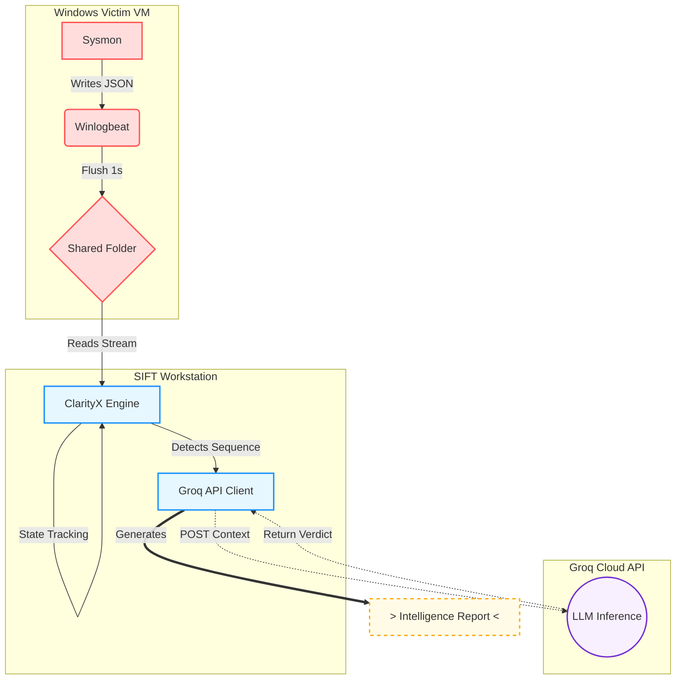

# Clarity-X: An AI-Driven DFIR Reasoning Engine


Clarity-X is a reasoning layer that sits between raw Sysmon logs and a security analyst. It acts as a cognitive filter, using a state machine to track process behavior and escalating suspicious activity to a Large Language Model (LLM) for analysis. Its primary goal is to reduce alert fatigue by distinguishing malicious activity from benign system noise.

## The Problem

Security Operations Center (SOC) analysts are often overwhelmed by "alert fatigue." Modern operating systems, like Windows, generate thousands of logs for benign activities (e.g., `svchost.exe` networking, administrative `whoami` checks). Traditional Security Information and Event Management (SIEM) systems flag these events individually, forcing analysts to manually correlate them to identify genuine threats.

## The Solution

Clarity-X is not a traditional detection engine; it is a **Reasoning Layer**. It ingests a real-time stream of Sysmon logs and builds a behavioral "session" for each process. Only when a process exhibits a **Critical Capability Sequence** (e.g., a network connection immediately followed by a file drop) does it trigger an AI agent (LLM) to review the context and generate a verdict. This approach filters over 99% of log noise, allowing analysts to focus on high-fidelity alerts.

## Key Features

- **Behavioral Sequencing**: Instead of flagging atomic events like "Event ID 3," Clarity-X flags meaningful sequences, such as "Event ID 3 (Network Connection) followed by Event ID 11 (File Create)."
- **Noise Gatekeeping**: Whitelists known benign process behaviors (e.g., Chrome browser networking) to conserve resources and reduce false positives.
- **Dual-Homed Analysis**: Designed for a segregated environment where the analyst machine has internet access for AI analysis, while the monitored endpoint remains isolated.
- **Prompt Injection Hardening**: Implements input sanitization on process data to mitigate risks of malicious input being passed to the LLM.

## Architecture



- **Sensor**: A Windows 11 environment instrumented with Sysmon and Winlogbeat, configured for 1-second log flushing to enable real-time event streaming.
- **Transport**: VirtualBox Shared Folders provide an air-gapped log transport mechanism, preventing network-based detection interference.
- **Cortex (Python Engine)**: A custom state machine that groups events by `ProcessGuid` and filters out benign sequences.
- **Cognition (Groq AI)**: An LLM integration that analyzes the JSON context of suspicious sequences to determine intent and render a verdict.

## Getting Started

### Prerequisites

- **Victim Machine**: A Windows system with Sysmon and Winlogbeat installed.
- **Analyst Machine**: A Linux/Python environment (such as the SANS SIFT Workstation).
- **API Key**: A valid API key from [Groq](https://wow.groq.com/).

### 1. Configure the Victim Machine

To achieve real-time log forwarding in a lab environment, Winlogbeat must be configured to disable buffering and write directly to the shared transport channel.

An example `winlogbeat.yml` is provided in the `config/` directory.

### 2. Configure the Analyst Machine

1.  **Clone the repository:**
    ```sh
    git clone https://github.com/LohithG2503/Clarity-X.git
    cd Clarity-X
    ```

2.  **Install dependencies:**
    ```sh
    pip3 install -r requirements.txt
    ```

3.  **Configure the API Key:**
    It is recommended to set your Groq API key as an environment variable. This prevents hardcoding secrets in the source code.

    For Linux/macOS:
    ```sh
    export GROQ_API_KEY="gsk_your_key_here"
    ```

    For Windows:
    ```powershell
    $env:GROQ_API_KEY="gsk_your_key_here"
    ```

## Usage

Run the engine from the root of the project directory:

```sh
python3 src/clarityx_engine.py
```

The engine will start monitoring the configured log source and will generate an intelligence report when a suspicious sequence is detected.

### Example Intelligence Report

```
--------------------------------------------------------------------------------
CLARITYX INTELLIGENCE REPORT | TARGET: POWERSHELL.EXE
--------------------------------------------------------------------------------
Intent: Malware Dropper
Reasoning: The event sequence summary indicates a file write operation to 
C:\Windows\Temp\malware.exe immediately following a network connection. 
The observed capabilities include PAYLOAD_DROP and the triggers fired include 
"Critical Sequence: Network -> Executable Drop".
Verdict: MALICIOUS
--------------------------------------------------------------------------------
```

## Roadmap

Future development plans include:
-   Integration with the MITRE ATT&CK Framework for tagging detections.
-   Support for offline analysis of EVTX log files.
-   Containerization with Docker for simplified deployment.
-   Advanced detection engineering for identifying more complex threat patterns.
-   Implementation of Retrieval-Augmented Generation (RAG) with vector mapping for enhanced contextual analysis.


## Contributing

Contributions are welcome. Please open an issue or submit a pull request to suggest improvements or add features.

## License

This project is licensed under the MIT License. See the [LICENSE](LICENSE) file for details.
